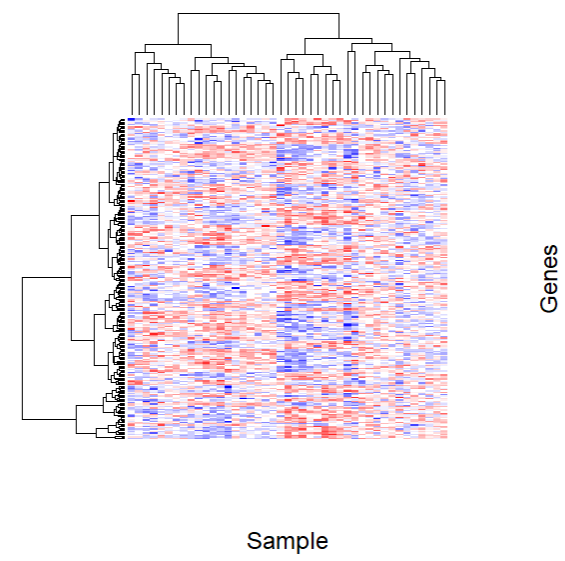
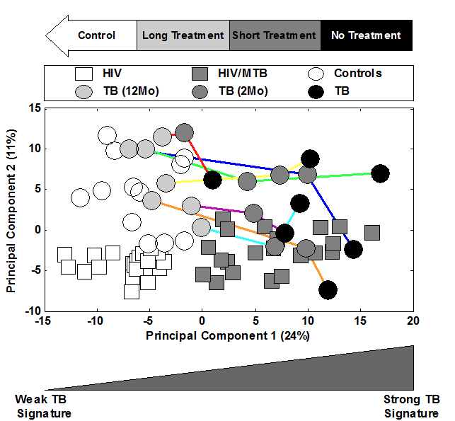

<style type="text/css">

body{ /* Normal  */
      font-size: 14px;
  }
h1, h2 { /* add border to h1 and h2 */
  border-bottom: solid 1px #666;
}
h1 { /* Header 1 */
  font-size: 56px;
  color: Black;
}
h2 { /* Header 2 */
    font-size: 18px;
  color: Black;
}
h3 { /* Header 3 */
  font-size: 16px;
  color: Grey;
}
</style>

```{r setup, include=FALSE, } 
knitr::opts_chunk$set(echo = TRUE, warning = FALSE, message = FALSE) 

library(tidyverse)
library(GEOquery)
library(org.Hs.eg.db)
library(limma)
library(edgeR)
library(Glimma)
library(Homo.sapiens)
library(phyloseq)
library(gtools)
library(e1071)
library(caret)
library(ROCR)
library(preprocessCore)
library(knitr)
library(ggfortify)
library(cowplot)
library(ComplexHeatmap)
library(RColorBrewer)
library(gridExtra)
library(gplots)
```

```{r Origin data, include=FALSE}
Origin <- getGEO("GSE50834", GSEMatrix = TRUE)[[1]]

Pheno = pData(Origin)

Genes = fData(Origin)

Expression <- exprs(Origin)
rnames = row.names(Expression)
cnames = colnames(Expression)

Expression_cut <- Expression %>% 
  as.data.frame() %>% 
  mutate(GSM1230946=(GSM1230903 + GSM1230904)/2) %>%
  dplyr::select(-GSM1230903) %>%
  dplyr::select(-GSM1230904) %>%
  relocate(GSM1230946,.after = GSM1230902) %>%
  dplyr::rename(GSM1230903=GSM1230946)

row.names(Expression_cut) = rnames
colnames(Expression_cut) = cnames[-3]

Pheno_cut <- Pheno %>% filter(title != "HIV infected patient 2_2")
```

```{r paper 251 genes, include = FALSE}
Genes_copy <- Genes
paper_251genes <- read.csv("Paper_251_genes.csv") %>% dplyr::rename(Accession=1) %>% filter(row_number() %in% c(1:251))

Genes_copy$Search_Key = sub("\\..*", "", Genes_copy$Search_Key)
#Genes paper 251 data
Gene_251_paper_fdata <- Genes_copy %>% inner_join(paper_251genes, by=c("Search_Key" = "Accession", "Symbol")) %>% filter(row_number() %in% c(1:251))

keep_genes_paper <- dput(Gene_251_paper_fdata %>% dplyr::select(ID) %>% unlist() %>% as.vector())
                                                                                                              
#Expression paper 251 data
Expression_251_paper <- Expression_cut[rownames(Expression_cut) %in% keep_genes_paper,]
```

# Abstract
The aim of this study is to replicate the findings of a published paper that aimed to identify a gene signature that could distinguish Mycobacterium tuberculosis(TB) and Human immunodeficiency virus (HIV) co-infected patients from patients with HIV only.

Methodology of the published paper was followed beginning with initial data preprocessing followed by finding a 251 gene expression signature using support vector machine recursive feature elimination(SVM-RFE) then validating the classifier using the 6 test sets reportedly used. Receiving operating characteristic curves were plotted and the sensitivity, specificity, area under the curve(AUC) and accuracy values were found. A heatmap on the training data was created and principal component analysis was conducted on the training data and Test Set 1.

It was found that reproducibility of the results in the published paper was met with great difficulty. This was due to missing information given in regards to the methodology used in the published paper as well as an incorrect study design and methodology in addressing the aim.

# Introduction 

Human immunodeficiency virus (HIV) is an enveloped retrovirus that attacks the immune system __(1)__. Mycobacterium tuberculosis (TB) is an infectious disease with a high mortality, second only to Covid-19. 10 million individuals contracted TB and 1.5 million people died from TB in 2020 with 214,000 also having HIV __(2)__. TB only requires a few particles for infection. Once infected, it usually becomes latent in most individuals, but there is a 5-10% risk of TB becoming active __(3)__.
 
A factor that can increase the risk of TB becoming activated is immunosuppression. People with HIV are 18x more likely to develop active TB. HIV causes depletion and exhaustion of immune cells like CD4+ t cells which are required for the immune system to fight TB. Thus having a co-infection of HIV/TB causes both disease progressions to accelerate.  TB has become the leading cause of death in individuals with HIV __(3)__.
 
TB is curable with the right treatment regime however, TB must first be detected. 45% of HIV-negative individuals will die without proper treatment but for HIV-positive individuals, nearly all will die without treatment __(2)__, hence why detecting TB in an individual with HIV is of upmost importance.Current diagnostic tools have reduced sensitivity in detecting TB in HIV-positive individuals which can lead to false negatives. When combining two tests, the LAM and Xpert MTB/RIF, together, only 80% of symptomatic individuals are detected. Some studies have explored gene expression in HIV/TB individuals to identify possible biomarkers however currently, no gene signatures have been identified that can identify HIV/TB co-infection __(4)__.

During 2014, a paper titled 'Identification of a 251 Gene Expression Signature That Can Accurately Detect M. tuberculosis in Patients with and without HIV Co-Infection' was published which reportedly found a 251 Gene Expression Signature that could distinguish HIV patients from HIV patients co-infected with TB. Critique of this paper is necessary as published findings can be used for further application and research, thus, it must be ensured that the results and conclusions drawn are accurate. Here an attempt to replicate the findings will be conducted and a judgement on the appropriateness of the method and analysis will be made. 

# Method 

## Subjects
Replication and analysis were based on 43 study subjects recruited from the Themba Lethu Clinic in Johannesburg South Africa between the 6th of September 2007 to the 16th of October 2008. The 43 subjects consisted of 22 patients that were mono-infected with HIV and 21 patients that were co-infected with HIV/TB.

## Data Preprocessing
Raw gene expression microarray data was reportedly quantile normalized. Retrieval of the data revealed that normalized data was provided and that access to the pre-normalized data was not provided, therefore, quantile normalization was unable to be replicated and subsequent analysis was based on the normalized data given. Figure 1 displays boxplots indicating quantile normalization on the gene expression data.

```{r boxplot, fig.cap="Figure 1: Boxplot of Gene Expression of Samples"}
Expression %>% 
  as.data.frame() %>% 
  filter_all(all_vars(. < 1000)) %>% 
  boxplot(las =2, cex.axis = 0.5)
```

There existed one patient with two sample IDs of which were GSM1230903 and GSM1230904. Prior to further analysis, the gene expression data was averaged for this patient.

```{r removing duplicate}
Expression_cut <- Expression %>% 
  as.data.frame() %>% 
  mutate(GSM1230946=(GSM1230903 + GSM1230904)/2) %>%
  dplyr::select(-GSM1230903) %>%
  dplyr::select(-GSM1230904) %>%
  relocate(GSM1230946,.after = GSM1230902) %>%
  dplyr::rename(GSM1230903=GSM1230946)

row.names(Expression_cut) = rnames
colnames(Expression_cut) = cnames[-3]
Pheno_cut <- Pheno %>% filter(title != "HIV infected patient 2_2")
```

It was reported that non-informative probes that had a maximum fold change less than 1.2 between any two samples were removed due to showing little variation or being expressed at the background level. Upon replication, fold change was calculated for all genes between any two samples and there were no genes found to have a fold change less than 1.2.

```{r  maximum foldchange, eval = F}
#calculating fold change between samples for all genes 
data = Expression_cut

Keep = c()
for (row in 1:nrow(data)) {
  changes_forward = c()
  names_forward = c()
  changes_backward = c()
  names_backward = c()
  for (a in 1:(ncol(data)-1)){
    col1 = a
    col2 = a
    while(col2 <= ncol(data)-1) {
      col2 = col2 + 1
      fc_forward = data[row,col1]/data[row,col2]
      changes_forward = c(changes_forward, fc_forward)
      
      fc_backward = data[row,col2]/data[row,col1]
      changes_backward = c(changes_backward, fc_backward)
    }
  }
  foldchange = data.frame(change_f = changes_forward, 
                          change_b = changes_backward)
  foldchange$max <- apply(foldchange, MARGIN = 1, FUN = max)
  
  if (max(foldchange$max) <1.2) {
    truth = FALSE
  }
  else {
    truth = TRUE
  }
  
  Keep = c(Keep, truth)
}

table(Keep)
```

## 251 Gene Expression Signature 
Multiple iterations of support vector machine(SVM) were run on the full dataset where 10% of the bottom weights were removed in each iteration until 251 genes were returned. A score was assigned by the SVM classifier to each sample with a positive score indicating a prediction of TB and a negative score indicating a prediction of no active TB. A heatmap of the gene expression was produced to visualise whether the genes could be clustered into groups.  

## Independent Validation Samples
TB associated datasets were reportedly used to validate the reported study, hence these datasets were also used upon replication. The associated test sets (TS1,TS3,TS4,TS5) were normalized through replication of the reported steps. Normalization consisted of having the mean expression per probe in each dataset separately calculated and the overall mean calculated. Within a sample, each probe's expression level was adjusted by this difference. TS6 was normalized through median quantile normalization followed by adjustment of each sample's expression by the difference between the mean overall expression and the mean across TS1,TS3,TS4,TS5 as reported.

The dataset stemming from GSE19435 was split into TS1 and TS2 of which
TS1 consisted of 12 healthy patients and 7 active TB patients on 2 months of treatment and TS2 consisted of 7 active TB patients on no treatment and 7 active TB patients on 12 months of treatment. TS3 consisted of 12 healthy patients, 17 latent TB patients and 12 active TB patients on no treatment. There were 12 healthy patients in TS4, 21 latent TB patients and 21 active TB patients on no treatment in TS4, 31 latent TB patients and 20 active TB patients on no treatment in TS5, and 38 latent TB patients and 29 active TB patients on no treatment in TS6.

```{r testset data extraction, echo=TRUE, results=FALSE}
#code for extracting testset data and normalisation 
TS1 <- getGEO("GSE19435", GSEMatrix = TRUE)[[1]]
TS3 <- getGEO("GSE19439", GSEMatrix = TRUE)[[1]]
TS4 <- getGEO("GSE19444", GSEMatrix = TRUE)[[1]]
TS5 <- getGEO("GSE19442", GSEMatrix = TRUE)[[1]]
TS6 <- getGEO("GSE40553", GSEMatrix = TRUE)[[1]]

#Sample(patient) data
Pheno_TS1 = pData(TS1)

#Gene data 
Genes_TS1 = fData(TS1)

#gene expression data
Expression_TS1 <- exprs(TS1)
rnames_TS1 = row.names(Expression_TS1)
cnames_TS1 = colnames(Expression_TS1)

TS1_mean.df <- as.data.frame(Expression_TS1) %>% 
  rowwise() %>% 
  mutate(TS1_mean = mean(c_across(1:33))) 

Expression_TS1_gene <- as.data.frame(Expression_TS1) %>% tibble::rownames_to_column("Gene") 
E_TS1_gene <- Expression_TS1_gene %>% dplyr::select(Gene)

TS1_mean_gene <- cbind(E_TS1_gene, TS1_mean.df)

#Sample(patient) data
Pheno_TS3 = pData(TS3)

#Gene data 
Genes_TS3 = fData(TS3)

#gene expression data
Expression_TS3 <- exprs(TS3)
rnames_TS3 = row.names(Expression_TS3)
cnames_TS3 = colnames(Expression_TS3)


TS3_mean.df <- as.data.frame(Expression_TS3) %>% 
  rowwise() %>% 
  mutate(TS3_mean = mean(c_across(1:42))) 

Expression_TS3_gene <- as.data.frame(Expression_TS3) %>% tibble::rownames_to_column("Gene") 
E_TS3_gene <- Expression_TS3_gene %>% dplyr::select(Gene)

TS3_mean_gene <- cbind(E_TS3_gene, TS3_mean.df)

#Sample(patient) data
Pheno_TS4 = pData(TS4)

#Gene data 
Genes_TS4 = fData(TS4)

#gene expression data
Expression_TS4 <- exprs(TS4)
rnames_TS4 = row.names(Expression_TS4)
cnames_TS4 = colnames(Expression_TS4)

TS4_mean.df <- as.data.frame(Expression_TS4) %>% 
  rowwise() %>% 
  mutate(TS4_mean = mean(c_across(1:54)))

Expression_TS4_gene <- as.data.frame(Expression_TS4) %>% tibble::rownames_to_column("Gene") 
E_TS4_gene <- Expression_TS4_gene %>% dplyr::select(Gene)

TS4_mean_gene <- cbind(E_TS4_gene, TS4_mean.df)

#Sample(patient) data
Pheno_TS5 = pData(TS5)

#Gene data 
Genes_TS5 = fData(TS5)

#gene expression data
Expression_TS5 <- exprs(TS5)
rnames_TS5 = row.names(Expression_TS5)
cnames_TS5 = colnames(Expression_TS5)

TS5_mean.df <- as.data.frame(Expression_TS5) %>% 
  rowwise() %>% 
  mutate(TS5_mean = mean(c_across(1:51))) 

Expression_TS5_gene <- as.data.frame(Expression_TS5) %>% tibble::rownames_to_column("Gene") 
E_TS5_gene <- Expression_TS5_gene %>% dplyr::select(Gene)

TS5_mean_gene <- cbind(E_TS5_gene, TS5_mean.df)

#Sample(patient) data
Pheno_TS6 = pData(TS6)

#Gene data 
Genes_TS6 = fData(TS6)

#gene expression data
Expression_TS6 <- exprs(TS6)
rnames_TS6 = row.names(Expression_TS6)
cnames_TS6 = colnames(Expression_TS6)

TS6_quantile_normalized <- as.data.frame(normalize.quantiles(exprs(TS6)))

row.names(TS6_quantile_normalized) = rnames_TS6
colnames(TS6_quantile_normalized) = cnames_TS6

TS6_mean.df <- TS6_quantile_normalized %>% rowwise() %>% dplyr::mutate(TS6_mean = mean(c_across(1:204)))

Expression_TS6_gene <- as.data.frame(Expression_TS6) %>% tibble::rownames_to_column("Gene") 
E_TS6_gene <- Expression_TS6_gene %>% dplyr::select(Gene)

TS6_mean_gene <- cbind(E_TS6_gene, TS6_mean.df)

TS1_5 <- TS1_mean_gene %>% full_join(TS3_mean_gene) %>% 
  full_join(TS3_mean_gene) %>%
  full_join(TS4_mean_gene) %>%
  full_join(TS5_mean_gene)

# average and difference across all samples from the 4 datasets (TS1,3,4,5)
TS1_5_average_and_diff <- TS1_5 %>% dplyr::select(Gene, TS1_mean, TS3_mean, TS4_mean, TS5_mean) %>% 
  rowwise %>%
  mutate(TS1_3_4_5_mean = mean(c_across(2:5))) %>%
  mutate(TS1_diff = TS1_3_4_5_mean - TS1_mean) %>%
  mutate(TS3_diff = TS1_3_4_5_mean - TS3_mean) %>%
  mutate(TS4_diff = TS1_3_4_5_mean - TS4_mean) %>%
  mutate(TS5_diff = TS1_3_4_5_mean - TS5_mean)

#TS1 normalized
TS1_normalized<- TS1_mean_gene %>% left_join(TS1_5_average_and_diff) %>% 
  dplyr::select(-TS3_mean, -TS4_mean, -TS5_mean, -TS3_diff, -TS4_diff, -TS5_diff, -TS1_mean, -TS1_3_4_5_mean) %>%
  rowwise() %>%
  mutate(GSM484368 = GSM484368 + TS1_diff) %>%
  mutate(GSM484369 = GSM484369 + TS1_diff) %>%
  mutate(GSM484370 = GSM484370 + TS1_diff) %>%
  mutate(GSM484371 = GSM484371 + TS1_diff) %>%
  mutate(GSM484372 = GSM484372 + TS1_diff) %>%
  mutate(GSM484373 = GSM484373 + TS1_diff) %>%
  mutate(GSM484374 = GSM484374 + TS1_diff) %>%
  mutate(GSM484375 = GSM484375 + TS1_diff) %>%
  mutate(GSM484376 = GSM484376 + TS1_diff) %>%
  mutate(GSM484377 = GSM484377 + TS1_diff) %>%
  mutate(GSM484378 = GSM484378 + TS1_diff) %>%
  mutate(GSM484379 = GSM484379 + TS1_diff) %>%
  mutate(GSM484380 = GSM484380 + TS1_diff) %>%
  mutate(GSM484381 = GSM484381 + TS1_diff) %>%
  mutate(GSM484382 = GSM484382 + TS1_diff) %>%
  mutate(GSM484383 = GSM484383 + TS1_diff) %>%
  mutate(GSM484384 = GSM484384 + TS1_diff) %>%
  mutate(GSM484385 = GSM484385 + TS1_diff) %>%
  mutate(GSM484386 = GSM484386 + TS1_diff) %>%
  mutate(GSM484387 = GSM484387 + TS1_diff) %>%
  mutate(GSM484388 = GSM484388 + TS1_diff) %>%
  mutate(GSM484389 = GSM484389 + TS1_diff) %>%
  mutate(GSM484390 = GSM484390 + TS1_diff) %>%
  mutate(GSM484391 = GSM484391 + TS1_diff) %>%
  mutate(GSM484392 = GSM484392 + TS1_diff) %>%
  mutate(GSM484393 = GSM484393 + TS1_diff) %>%
  mutate(GSM484394 = GSM484394 + TS1_diff) %>%
  mutate(GSM484395 = GSM484395 + TS1_diff) %>%
  mutate(GSM484396 = GSM484396 + TS1_diff) %>%
  mutate(GSM484397 = GSM484397 + TS1_diff) %>%
  mutate(GSM484398 = GSM484398 + TS1_diff) %>%
  mutate(GSM484399 = GSM484399 + TS1_diff) %>%
  mutate(GSM484400 = GSM484400 + TS1_diff) %>%
  dplyr::select(-TS1_diff)

#TS3 normalized
TS3_normalized<- TS3_mean_gene %>% left_join(TS1_5_average_and_diff) %>% 
  dplyr::select(-TS1_mean, -TS4_mean, -TS5_mean, -TS1_diff, -TS4_diff, -TS5_diff, -TS3_mean, -TS1_3_4_5_mean) %>%
  rowwise() %>%
  mutate(GSM484448 = GSM484448 + TS3_diff) %>%
  mutate(GSM484449 = GSM484449 + TS3_diff) %>%
  mutate(GSM484450 = GSM484450 + TS3_diff) %>%
  mutate(GSM484451 = GSM484451 + TS3_diff) %>%
  mutate(GSM484452 = GSM484452 + TS3_diff) %>%
  mutate(GSM484453 = GSM484453 + TS3_diff) %>%
  mutate(GSM484454 = GSM484454 + TS3_diff) %>%
  mutate(GSM484455 = GSM484455 + TS3_diff) %>%
  mutate(GSM484456 = GSM484456 + TS3_diff) %>%
  mutate(GSM484457 = GSM484457 + TS3_diff) %>%
  mutate(GSM484458 = GSM484458 + TS3_diff) %>%
  mutate(GSM484459 = GSM484459 + TS3_diff) %>%
  mutate(GSM484460 = GSM484460 + TS3_diff) %>%
  mutate(GSM484461 = GSM484461 + TS3_diff) %>%
  mutate(GSM484462 = GSM484462 + TS3_diff) %>%
  mutate(GSM484463 = GSM484463 + TS3_diff) %>%
  mutate(GSM484464 = GSM484464 + TS3_diff) %>%
  mutate(GSM484465 = GSM484465 + TS3_diff) %>%
  mutate(GSM484466 = GSM484466 + TS3_diff) %>%
  mutate(GSM484467 = GSM484467 + TS3_diff) %>%
  mutate(GSM484468 = GSM484468 + TS3_diff) %>%
  mutate(GSM484469 = GSM484469 + TS3_diff) %>%
  mutate(GSM484470 = GSM484470 + TS3_diff) %>%
  mutate(GSM484471 = GSM484471 + TS3_diff) %>%
  mutate(GSM484472 = GSM484472 + TS3_diff) %>%
  mutate(GSM484473 = GSM484473 + TS3_diff) %>%
  mutate(GSM484474 = GSM484474 + TS3_diff) %>%
  mutate(GSM484475 = GSM484475 + TS3_diff) %>%
  mutate(GSM484476 = GSM484476 + TS3_diff) %>%
  mutate(GSM484477 = GSM484477 + TS3_diff) %>%
  mutate(GSM484478 = GSM484478 + TS3_diff) %>%
  mutate(GSM484479 = GSM484479 + TS3_diff) %>%
  mutate(GSM484480 = GSM484480 + TS3_diff) %>%
  mutate(GSM484481 = GSM484481 + TS3_diff) %>%
  mutate(GSM484482 = GSM484482 + TS3_diff) %>%
  mutate(GSM484483 = GSM484483 + TS3_diff) %>%
  mutate(GSM484484 = GSM484484 + TS3_diff) %>%
  mutate(GSM484485 = GSM484485 + TS3_diff) %>%
  mutate(GSM484486 = GSM484486 + TS3_diff) %>%
  mutate(GSM484487 = GSM484487 + TS3_diff) %>%
  mutate(GSM484488 = GSM484488 + TS3_diff) %>%
  mutate(GSM484489 = GSM484489 + TS3_diff) %>%
  dplyr::select(-TS3_diff)
  

#TS4 normalized
TS4_normalized<- TS4_mean_gene %>% left_join(TS1_5_average_and_diff) %>% 
  dplyr::select(-TS1_mean, -TS3_mean, -TS5_mean, -TS1_diff, -TS3_diff, -TS5_diff, -TS4_mean, -TS1_3_4_5_mean) %>%
  rowwise() %>%
  mutate(GSM484595 = GSM484595 + TS4_diff) %>%
  mutate(GSM484596 = GSM484596 + TS4_diff) %>%
  mutate(GSM484597 = GSM484597 + TS4_diff) %>%
  mutate(GSM484598 = GSM484598 + TS4_diff) %>%
  mutate(GSM484599 = GSM484599 + TS4_diff) %>%
  mutate(GSM484600 = GSM484600 + TS4_diff) %>%
  mutate(GSM484601 = GSM484601 + TS4_diff) %>%
  mutate(GSM484602 = GSM484602 + TS4_diff) %>%
  mutate(GSM484603 = GSM484603 + TS4_diff) %>%
  mutate(GSM484604 = GSM484604 + TS4_diff) %>%
  mutate(GSM484605 = GSM484605 + TS4_diff) %>%
  mutate(GSM484606 = GSM484606 + TS4_diff) %>%
  mutate(GSM484607 = GSM484607 + TS4_diff) %>%
  mutate(GSM484608 = GSM484608 + TS4_diff) %>%
  mutate(GSM484609 = GSM484609 + TS4_diff) %>%
  mutate(GSM484610 = GSM484610 + TS4_diff) %>%
  mutate(GSM484611 = GSM484611 + TS4_diff) %>%
  mutate(GSM484612 = GSM484612 + TS4_diff) %>%
  mutate(GSM484613 = GSM484613 + TS4_diff) %>%
  mutate(GSM484614 = GSM484614 + TS4_diff) %>%
  mutate(GSM484615 = GSM484615 + TS4_diff) %>%
  mutate(GSM484616 = GSM484616 + TS4_diff) %>%
  mutate(GSM484617 = GSM484617 + TS4_diff) %>%
  mutate(GSM484618 = GSM484618 + TS4_diff) %>%
  mutate(GSM484619 = GSM484619 + TS4_diff) %>%
  mutate(GSM484620 = GSM484620 + TS4_diff) %>%
  mutate(GSM484621 = GSM484621 + TS4_diff) %>%
  mutate(GSM484622 = GSM484622 + TS4_diff) %>%
  mutate(GSM484623 = GSM484623 + TS4_diff) %>%
  mutate(GSM484624 = GSM484624 + TS4_diff) %>%
  mutate(GSM484625 = GSM484625 + TS4_diff) %>%
  mutate(GSM484626 = GSM484626 + TS4_diff) %>%
  mutate(GSM484627 = GSM484627 + TS4_diff) %>%
  mutate(GSM484628 = GSM484628 + TS4_diff) %>%
  mutate(GSM484629 = GSM484629 + TS4_diff) %>%
  mutate(GSM484630 = GSM484630 + TS4_diff) %>%
  mutate(GSM484631 = GSM484631 + TS4_diff) %>%
  mutate(GSM484632 = GSM484632 + TS4_diff) %>%
  mutate(GSM484633 = GSM484633 + TS4_diff) %>%
  mutate(GSM484634 = GSM484634 + TS4_diff) %>%
  mutate(GSM484635 = GSM484635 + TS4_diff) %>%
  mutate(GSM484636 = GSM484636 + TS4_diff) %>%
  mutate(GSM484637 = GSM484637 + TS4_diff) %>%
  mutate(GSM484638 = GSM484638 + TS4_diff) %>%
  mutate(GSM484639 = GSM484639 + TS4_diff) %>%
  mutate(GSM484640 = GSM484640 + TS4_diff) %>%
  mutate(GSM484641 = GSM484641 + TS4_diff) %>%
  mutate(GSM484642 = GSM484642 + TS4_diff) %>%
  mutate(GSM484643 = GSM484643 + TS4_diff) %>%
  mutate(GSM484644 = GSM484644 + TS4_diff) %>%
  mutate(GSM484645 = GSM484645 + TS4_diff) %>%
  mutate(GSM484646 = GSM484646 + TS4_diff) %>%
  mutate(GSM484647 = GSM484647 + TS4_diff) %>%
  mutate(GSM484648 = GSM484648 + TS4_diff) %>%
  dplyr::select(-TS4_diff)


#TS5 normalized
TS5_normalized<- TS5_mean_gene %>% left_join(TS1_5_average_and_diff) %>% 
  dplyr::select(-TS1_mean, -TS3_mean, -TS4_mean, -TS1_diff, -TS3_diff, -TS4_diff, -TS5_mean, -TS1_3_4_5_mean) %>%
  rowwise() %>%
  mutate(GSM484500 = GSM484500 + TS5_diff) %>%
  mutate(GSM484501 = GSM484501 + TS5_diff) %>%
  mutate(GSM484502 = GSM484502 + TS5_diff) %>%
  mutate(GSM484503 = GSM484503 + TS5_diff) %>%
  mutate(GSM484504 = GSM484504 + TS5_diff) %>%
  mutate(GSM484505 = GSM484505 + TS5_diff) %>%
  mutate(GSM484506 = GSM484506 + TS5_diff) %>%
  mutate(GSM484507 = GSM484507 + TS5_diff) %>%
  mutate(GSM484508 = GSM484508 + TS5_diff) %>%
  mutate(GSM484509 = GSM484509 + TS5_diff) %>%
  mutate(GSM484510 = GSM484510 + TS5_diff) %>%
  mutate(GSM484511 = GSM484511 + TS5_diff) %>%
  mutate(GSM484512 = GSM484512 + TS5_diff) %>%
  mutate(GSM484513 = GSM484513 + TS5_diff) %>%
  mutate(GSM484514 = GSM484514 + TS5_diff) %>%
  mutate(GSM484515 = GSM484515 + TS5_diff) %>%
  mutate(GSM484516 = GSM484516 + TS5_diff) %>%
  mutate(GSM484517 = GSM484517 + TS5_diff) %>%
  mutate(GSM484518 = GSM484518 + TS5_diff) %>%
  mutate(GSM484519 = GSM484519 + TS5_diff) %>%
  mutate(GSM484520 = GSM484520 + TS5_diff) %>%
  mutate(GSM484521 = GSM484521 + TS5_diff) %>%
  mutate(GSM484522 = GSM484522 + TS5_diff) %>%
  mutate(GSM484523 = GSM484523 + TS5_diff) %>%
  mutate(GSM484524 = GSM484524 + TS5_diff) %>%
  mutate(GSM484525 = GSM484525 + TS5_diff) %>%
  mutate(GSM484526 = GSM484526 + TS5_diff) %>%
  mutate(GSM484527 = GSM484527 + TS5_diff) %>%
  mutate(GSM484528 = GSM484528 + TS5_diff) %>%
  mutate(GSM484529 = GSM484529 + TS5_diff) %>%
  mutate(GSM484530 = GSM484530 + TS5_diff) %>%
  mutate(GSM484531 = GSM484531 + TS5_diff) %>%
  mutate(GSM484532 = GSM484532 + TS5_diff) %>%
  mutate(GSM484533 = GSM484533 + TS5_diff) %>%
  mutate(GSM484534 = GSM484534 + TS5_diff) %>%
  mutate(GSM484535 = GSM484535 + TS5_diff) %>%
  mutate(GSM484536 = GSM484536 + TS5_diff) %>%
  mutate(GSM484537 = GSM484537 + TS5_diff) %>%
  mutate(GSM484538 = GSM484538 + TS5_diff) %>%
  mutate(GSM484539 = GSM484539 + TS5_diff) %>%
  mutate(GSM484540 = GSM484540 + TS5_diff) %>%
  mutate(GSM484541 = GSM484541 + TS5_diff) %>%
  mutate(GSM484542 = GSM484542 + TS5_diff) %>%
  mutate(GSM484543 = GSM484543 + TS5_diff) %>%
  mutate(GSM484544 = GSM484544 + TS5_diff) %>%
  mutate(GSM484545 = GSM484545 + TS5_diff) %>%
  mutate(GSM484546 = GSM484546 + TS5_diff) %>%
  mutate(GSM484547 = GSM484547 + TS5_diff) %>%
  mutate(GSM484548 = GSM484548 + TS5_diff) %>%
  mutate(GSM484549 = GSM484549 + TS5_diff) %>%
  mutate(GSM484550 = GSM484500 + TS5_diff) %>%
  dplyr::select(-TS5_diff)


#TS6 normalized
TS6_mean_diff<- TS6_mean_gene %>% left_join(TS1_5_average_and_diff) %>% 
  dplyr::select(-TS1_mean, -TS3_mean, -TS4_mean, -TS1_diff, -TS3_diff, -TS4_diff, -TS5_mean, -TS5_diff) %>% rowwise() %>% mutate(TS6_diff = TS1_3_4_5_mean - TS6_mean)

TS6_normalized <- TS6_mean_diff %>%
  rowwise() %>%
  mutate(GSM996267 = GSM996267 + TS6_diff) %>%
  mutate(GSM996268 = GSM996268 + TS6_diff) %>%
  mutate(GSM996269 = GSM996269 + TS6_diff) %>%
  mutate(GSM996270 = GSM996270 + TS6_diff) %>%
  mutate(GSM996271 = GSM996271 + TS6_diff) %>%
  mutate(GSM996272 = GSM996272 + TS6_diff) %>%
  mutate(GSM996273 = GSM996273 + TS6_diff) %>%
  mutate(GSM996274 = GSM996274 + TS6_diff) %>%
  mutate(GSM996275 = GSM996275 + TS6_diff) %>%
  mutate(GSM996276 = GSM996276 + TS6_diff) %>%
  mutate(GSM996277 = GSM996277 + TS6_diff) %>%
  mutate(GSM996278 = GSM996278 + TS6_diff) %>%
  mutate(GSM996279 = GSM996279 + TS6_diff) %>%
  mutate(GSM996280 = GSM996280 + TS6_diff) %>%
  mutate(GSM996281 = GSM996281 + TS6_diff) %>%
  mutate(GSM996282 = GSM996282 + TS6_diff) %>%
  mutate(GSM996283 = GSM996283 + TS6_diff) %>%
  mutate(GSM996284 = GSM996284 + TS6_diff) %>%
  mutate(GSM996285 = GSM996285 + TS6_diff) %>%
  mutate(GSM996286 = GSM996286 + TS6_diff) %>%
  mutate(GSM996287 = GSM996287 + TS6_diff) %>%
  mutate(GSM996288 = GSM996288 + TS6_diff) %>%
  mutate(GSM996289 = GSM996289 + TS6_diff) %>%
  mutate(GSM996290 = GSM996290 + TS6_diff) %>%
  mutate(GSM996291 = GSM996291 + TS6_diff) %>%
  mutate(GSM996292 = GSM996292 + TS6_diff) %>%
  mutate(GSM996293 = GSM996293 + TS6_diff) %>%
  mutate(GSM996294 = GSM996294 + TS6_diff) %>%
  mutate(GSM996295 = GSM996295 + TS6_diff) %>%
  mutate(GSM996296 = GSM996296 + TS6_diff) %>%
  mutate(GSM996297 = GSM996297 + TS6_diff) %>%
  mutate(GSM996298 = GSM996298 + TS6_diff) %>%
  mutate(GSM996299 = GSM996299 + TS6_diff) %>%
  mutate(GSM996300 = GSM996300 + TS6_diff) %>%
  mutate(GSM996311 = GSM996311 + TS6_diff) %>%
  mutate(GSM996312 = GSM996312 + TS6_diff) %>%
  mutate(GSM996313 = GSM996313 + TS6_diff) %>%
  mutate(GSM996314 = GSM996314 + TS6_diff) %>%
  mutate(GSM996315 = GSM996315 + TS6_diff) %>%
  mutate(GSM996316 = GSM996316 + TS6_diff) %>%
  mutate(GSM996317 = GSM996317 + TS6_diff) %>%
  mutate(GSM996318 = GSM996318 + TS6_diff) %>%
  mutate(GSM996319 = GSM996319 + TS6_diff) %>%
  mutate(GSM996320 = GSM996320 + TS6_diff) %>%
  mutate(GSM996321 = GSM996321 + TS6_diff) %>%
  mutate(GSM996322 = GSM996322 + TS6_diff) %>%
  mutate(GSM996323 = GSM996323 + TS6_diff) %>%
  mutate(GSM996324 = GSM996324 + TS6_diff) %>%
  mutate(GSM996325 = GSM996325 + TS6_diff) %>%
  mutate(GSM996326 = GSM996326 + TS6_diff) %>%
  mutate(GSM996327 = GSM996327 + TS6_diff) %>%
  mutate(GSM996328 = GSM996328 + TS6_diff) %>%
  mutate(GSM996329 = GSM996329 + TS6_diff) %>%
  mutate(GSM996330 = GSM996330 + TS6_diff) %>%
  mutate(GSM996331 = GSM996331 + TS6_diff) %>%
  mutate(GSM996332 = GSM996332 + TS6_diff) %>%
  mutate(GSM996333 = GSM996333 + TS6_diff) %>%
  mutate(GSM996334 = GSM996334 + TS6_diff) %>%
  mutate(GSM996335 = GSM996335 + TS6_diff) %>%
  mutate(GSM996336 = GSM996336 + TS6_diff) %>%
  mutate(GSM996337 = GSM996337 + TS6_diff) %>%
  mutate(GSM996338 = GSM996338 + TS6_diff) %>%
  mutate(GSM996339 = GSM996339 + TS6_diff) %>%
  mutate(GSM996340 = GSM996340 + TS6_diff) %>%
  mutate(GSM996341 = GSM996341 + TS6_diff) %>%
  mutate(GSM996342 = GSM996342 + TS6_diff) %>%
  mutate(GSM996343 = GSM996343 + TS6_diff) %>%
  mutate(GSM996344 = GSM996344 + TS6_diff) %>%
  mutate(GSM996345 = GSM996345 + TS6_diff) %>%
  mutate(GSM996346 = GSM996346 + TS6_diff) %>%
  mutate(GSM996347 = GSM996347 + TS6_diff) %>%
  mutate(GSM996348 = GSM996348 + TS6_diff) %>%
  mutate(GSM996349 = GSM996349 + TS6_diff) %>%
  mutate(GSM996350 = GSM996350 + TS6_diff) %>%
  mutate(GSM996351 = GSM996351 + TS6_diff) %>%
  mutate(GSM996352 = GSM996352 + TS6_diff) %>%
  mutate(GSM996353 = GSM996353 + TS6_diff) %>%
  mutate(GSM996354 = GSM996354 + TS6_diff) %>%
  mutate(GSM996355 = GSM996355 + TS6_diff) %>%
  mutate(GSM996356 = GSM996356 + TS6_diff) %>%
  mutate(GSM996357 = GSM996357 + TS6_diff) %>%
  mutate(GSM996358 = GSM996358 + TS6_diff) %>%
  mutate(GSM996359 = GSM996359 + TS6_diff) %>%
  mutate(GSM996360 = GSM996360 + TS6_diff) %>%
  mutate(GSM996361 = GSM996361 + TS6_diff) %>%
  mutate(GSM996362 = GSM996362 + TS6_diff) %>%
  mutate(GSM996363 = GSM996363 + TS6_diff) %>%
  mutate(GSM996364 = GSM996364 + TS6_diff) %>%
  mutate(GSM996365 = GSM996365 + TS6_diff) %>%
  mutate(GSM996366 = GSM996366 + TS6_diff) %>%
  mutate(GSM996367 = GSM996367 + TS6_diff) %>%
  mutate(GSM996368 = GSM996368 + TS6_diff) %>%
  mutate(GSM996369 = GSM996369 + TS6_diff) %>%
  mutate(GSM996370 = GSM996370 + TS6_diff) %>%
  mutate(GSM996371 = GSM996371 + TS6_diff) %>%
  mutate(GSM996372 = GSM996372 + TS6_diff) %>%
  mutate(GSM996373 = GSM996373 + TS6_diff) %>%
  mutate(GSM996374 = GSM996374 + TS6_diff) %>%
  mutate(GSM996375 = GSM996375 + TS6_diff) %>%
  mutate(GSM996376 = GSM996376 + TS6_diff) %>%
  mutate(GSM996377 = GSM996377 + TS6_diff) %>%
  mutate(GSM996378 = GSM996378 + TS6_diff) %>%
  mutate(GSM996379 = GSM996379 + TS6_diff) %>%
  mutate(GSM996380 = GSM996380 + TS6_diff) %>%
  mutate(GSM996381 = GSM996381 + TS6_diff) %>%
  mutate(GSM996382 = GSM996382 + TS6_diff) %>%
  mutate(GSM996383 = GSM996383 + TS6_diff) %>%
  mutate(GSM996384 = GSM996384 + TS6_diff) %>%
  mutate(GSM996385 = GSM996385 + TS6_diff) %>%
  mutate(GSM996386 = GSM996386 + TS6_diff) %>%
  mutate(GSM996387 = GSM996387 + TS6_diff) %>%
  mutate(GSM996388 = GSM996388 + TS6_diff) %>%
  mutate(GSM996389 = GSM996389 + TS6_diff) %>%
  mutate(GSM996390 = GSM996390 + TS6_diff) %>%
  mutate(GSM996391 = GSM996391 + TS6_diff) %>%
  mutate(GSM996392 = GSM996392 + TS6_diff) %>%
  mutate(GSM996393 = GSM996393 + TS6_diff) %>%
  mutate(GSM996394 = GSM996394 + TS6_diff) %>%
  mutate(GSM996395 = GSM996395 + TS6_diff) %>%
  mutate(GSM996396 = GSM996396 + TS6_diff) %>%
  mutate(GSM996397 = GSM996397 + TS6_diff) %>%
  mutate(GSM996398 = GSM996398 + TS6_diff) %>%
  mutate(GSM996399 = GSM996399 + TS6_diff) %>%
  mutate(GSM996400 = GSM996400 + TS6_diff) %>%
  mutate(GSM996401 = GSM996401 + TS6_diff) %>%
  mutate(GSM996402 = GSM996402 + TS6_diff) %>%
  mutate(GSM996403 = GSM996403 + TS6_diff) %>%
  mutate(GSM996404 = GSM996404 + TS6_diff) %>%
  mutate(GSM996405 = GSM996405 + TS6_diff) %>%
  mutate(GSM996406 = GSM996406 + TS6_diff) %>%
  mutate(GSM996407 = GSM996407 + TS6_diff) %>%
  mutate(GSM996408 = GSM996408 + TS6_diff) %>%
  mutate(GSM996409 = GSM996409 + TS6_diff) %>%
  mutate(GSM996410 = GSM996410 + TS6_diff) %>%
  mutate(GSM996411 = GSM996411 + TS6_diff) %>%
  mutate(GSM996412 = GSM996412 + TS6_diff) %>%
  mutate(GSM996413 = GSM996413 + TS6_diff) %>%
  mutate(GSM996414 = GSM996414 + TS6_diff) %>%
  mutate(GSM996415 = GSM996415 + TS6_diff) %>%
  mutate(GSM996416 = GSM996416 + TS6_diff) %>%
  mutate(GSM996417 = GSM996417 + TS6_diff) %>%
  mutate(GSM996418 = GSM996418 + TS6_diff) %>%
  mutate(GSM996419 = GSM996419 + TS6_diff) %>%
  mutate(GSM996420 = GSM996420 + TS6_diff) %>%
  mutate(GSM996421 = GSM996421 + TS6_diff) %>%
  mutate(GSM996422 = GSM996422 + TS6_diff) %>%
  mutate(GSM996423 = GSM996423 + TS6_diff) %>%
  mutate(GSM996424 = GSM996424 + TS6_diff) %>%
  mutate(GSM996425 = GSM996425 + TS6_diff) %>%
  mutate(GSM996426 = GSM996426 + TS6_diff) %>%
  mutate(GSM996427 = GSM996427 + TS6_diff) %>%
  mutate(GSM996428 = GSM996428 + TS6_diff) %>%
  mutate(GSM996429 = GSM996429 + TS6_diff) %>%
  mutate(GSM996430 = GSM996430 + TS6_diff) %>%
  mutate(GSM996431 = GSM996431 + TS6_diff) %>%
  mutate(GSM996432 = GSM996432 + TS6_diff) %>%
  mutate(GSM996433 = GSM996433 + TS6_diff) %>%
  mutate(GSM996434 = GSM996434 + TS6_diff) %>%
  mutate(GSM996435 = GSM996435 + TS6_diff) %>%
  mutate(GSM996436 = GSM996436 + TS6_diff) %>%
  mutate(GSM996437 = GSM996437 + TS6_diff) %>%
  mutate(GSM996438 = GSM996438 + TS6_diff) %>%
  mutate(GSM996439 = GSM996439 + TS6_diff) %>%
  mutate(GSM996440 = GSM996440 + TS6_diff) %>%
  mutate(GSM996441 = GSM996441 + TS6_diff) %>%
  mutate(GSM996442 = GSM996442 + TS6_diff) %>%
  mutate(GSM996443 = GSM996443 + TS6_diff) %>%
  mutate(GSM996444 = GSM996444 + TS6_diff) %>%
  mutate(GSM996445 = GSM996445 + TS6_diff) %>%
  mutate(GSM996446 = GSM996446 + TS6_diff) %>%
  mutate(GSM996447 = GSM996447 + TS6_diff) %>%
  mutate(GSM996448 = GSM996448 + TS6_diff) %>%
  mutate(GSM996449 = GSM996449 + TS6_diff) %>%
  mutate(GSM996450 = GSM996450 + TS6_diff) %>%
  mutate(GSM996451 = GSM996451 + TS6_diff) %>%
  mutate(GSM996452 = GSM996452 + TS6_diff) %>%
  mutate(GSM996453 = GSM996453 + TS6_diff) %>%
  mutate(GSM996454 = GSM996454 + TS6_diff) %>%
  mutate(GSM996455 = GSM996455 + TS6_diff) %>%
  mutate(GSM996456 = GSM996456 + TS6_diff) %>%
  mutate(GSM996457 = GSM996457 + TS6_diff) %>%
  mutate(GSM996458 = GSM996458 + TS6_diff) %>%
  mutate(GSM996459 = GSM996459 + TS6_diff) %>%
  mutate(GSM996460 = GSM996460 + TS6_diff) %>%
  mutate(GSM996461 = GSM996461 + TS6_diff) %>%
  mutate(GSM996462 = GSM996462 + TS6_diff) %>%
  mutate(GSM996463 = GSM996463 + TS6_diff) %>%
  mutate(GSM996464 = GSM996464 + TS6_diff) %>%
  mutate(GSM996465 = GSM996465 + TS6_diff) %>%
  mutate(GSM996466 = GSM996466 + TS6_diff) %>%
  mutate(GSM996467 = GSM996467 + TS6_diff) %>%
  mutate(GSM996468 = GSM996468 + TS6_diff) %>%
  mutate(GSM996469 = GSM996469 + TS6_diff) %>%
  mutate(GSM996470 = GSM996470 + TS6_diff) %>%
  mutate(GSM996471 = GSM996471 + TS6_diff) %>%
  mutate(GSM996472 = GSM996472 + TS6_diff) %>%
  mutate(GSM996473 = GSM996473 + TS6_diff) %>%
  mutate(GSM996474 = GSM996474 + TS6_diff) %>%
  mutate(GSM996475 = GSM996475 + TS6_diff) %>%
  mutate(GSM996476 = GSM996476 + TS6_diff) %>%
  mutate(GSM996477 = GSM996477 + TS6_diff) %>%
  mutate(GSM996478 = GSM996478 + TS6_diff) %>%
  mutate(GSM996479 = GSM996479 + TS6_diff) %>%
  mutate(GSM996480 = GSM996480 + TS6_diff) %>%
  dplyr::select(-TS6_diff, -TS1_3_4_5_mean, -TS6_mean)

#normalized data with only sample IDs as columns
#TS1 normalized
TS1_normalized.1 <- TS1_normalized %>%`row.names<-`(., NULL) %>% column_to_rownames(var = "Gene")

#TS3 normalized
TS3_normalized.1 <- TS3_normalized %>%`row.names<-`(., NULL) %>% column_to_rownames(var = "Gene")

#TS4 normalized
TS4_normalized.1 <- TS4_normalized %>%`row.names<-`(., NULL) %>% column_to_rownames(var = "Gene")

#TS5 normalized
TS5_normalized.1 <- TS5_normalized %>%`row.names<-`(., NULL) %>% column_to_rownames(var = "Gene")

#TS6 normalized
TS6_normalized.1 <- TS6_normalized %>%`row.names<-`(., NULL) %>% column_to_rownames(var = "Gene")

Pheno_TS1_new <- Pheno_TS1 %>% filter(`illness:ch1` == "Control" | `time post initiation of treatment:ch1` == "2_months")

#TS1 and TS2 for analysis data
Pheno_TS2_part1 <- Pheno_TS1 %>% filter(`time post initiation of treatment:ch1` == "0_months" & `illness:ch1` == "PTB")
Pheno_TS2_part2 <- Pheno_TS1 %>% filter(`time post initiation of treatment:ch1` == "12_months")
Pheno_TS2 <- rbind(Pheno_TS2_part1, Pheno_TS2_part2)

Pheno_TS1_new_sampleid.df <- Pheno_TS1_new %>% tibble::rownames_to_column("Sample_ID")
Pheno_TS1_new_sampleid_vector <- Pheno_TS1_new_sampleid.df[, "Sample_ID"]
Pheno_TS1_new_sampleid <- dput(as.character(Pheno_TS1_new_sampleid_vector))
Expression_TS1_normalized_new <- TS1_normalized.1[, colnames(TS1_normalized.1) %in% Pheno_TS1_new_sampleid]

Pheno_TS2_sampleid.df <- Pheno_TS2 %>% tibble::rownames_to_column("Sample_ID")
Pheno_TS2_sampleid_vector <- Pheno_TS2_sampleid.df[, "Sample_ID"]
Pheno_TS2_sampleid <- dput(as.character(Pheno_TS2_sampleid_vector))
Expression_TS2_normalized <- TS1_normalized.1[, colnames(TS1_normalized.1) %in% Pheno_TS2_sampleid]
```

Principal Component Analysis(PCA) was conducted on the training set and TS1 to cluster the data for the presence of TB. The sensitivity, specificity and accuracy were found and a receiving operating characteristic(ROC) curve was produced with the area under the curve(AUC) calculated for the training set and all the test sets.

# Results 

## Identification of a 251-Gene Signature Distinguishing HIV/TB Co-infected from HIV Mono-infected Patients

#### Top 20 Genes from the 251-Gene TB-Signature Identified using Support Vector Machine Recursive Feature Elimination (SVM-RFE)

```{r paper top 20 genes} 
fc_paper_20 <- c(1.402, 1.172, 1.248, -1.260, 1.492, 1.422, 1.374, 1.256, 1.441, 1.336, 1.454, 1.102, 1.255, -1.586, 1.421, -1.234, 1.131, 1.253, -3.149, 1.275)
Paper_top20genes <- read.csv("Paper_top20genes.csv") %>% dplyr::rename(Rank=1, `Gene Name` = Gene.Name, `Fold Change (HIV+TB)/HIV` = Fold.Change..HIV.TB..HIV) %>% transmute(Rank, Accession, Symbol, `Gene Name`, `Fold Change (HIV+TB)/HIV` = fc_paper_20)

kable(Paper_top20genes, caption = "Table 1.The Published Paper's Top 20 Genes from the 251 Gene Signature Identified Using SVM-RFE")
```

```{r our top 20 genes, eval = F, echo=TRUE, message=FALSE, warning=FALSE, results='hide'}
# Generating dataset for SVM
Expression_data <- t(Expression_cut) %>% as.data.frame()
Class_data <- factor(Pheno_cut$description) %>% as.data.frame()
colnames(Class_data) = "Class"
svm_data <- cbind(Expression_data, Class_data)

#finding best tuning parameters 
#set.seed(1)
#tune_svm <- tune.svm(Pheno_cut_description~., data=svm_data, cost=seq(1,2,by=0.1), kernel="linear")
#tune_svm$best.parameters
#summary(tune_svm)

#SVM-RFE
set.seed(3002)

n = 1000

df = svm_data

while (n > 280) {
  
  fit = svm(Class ~ ., data = df, kernel = "linear", cost = 1)  
  
  weights = t(fit$coefs) %*% fit$SV %>% as.data.frame()
  
  
  absolute_weights_sorted <- 
    t(sort(abs(weights), decreasing = T)) %>% 
    as.data.frame() %>% 
    dplyr::rename(weights=V1) %>% 
    tibble::rownames_to_column("Gene")
  
  n = round(0.9*nrow(absolute_weights_sorted),0)
  print(n)
  
  if (n < 290) {
    Genes_251 <- absolute_weights_sorted %>% arrange(desc(weights)) %>% head(251)
    keep_genes <- Genes_251$Gene
  }
  else {
    eliminate10 <- absolute_weights_sorted[1:n,] 
    keep_genes <- eliminate10$Gene
  }
  
  df_genes <- df[,colnames(df) %in% keep_genes]
  df <- cbind(df_genes, Class_data)
}
```

```{r top20 table}
Genes251 <- read.csv("251_gene_names.csv") %>% unlist() %>% as.vector()
foldchangevalues <- read.csv("Origin_genes_withfc.csv")
keep_genes <- dput(Genes251)

Expression_251 <- Expression_cut[rownames(Expression_cut) %in% Genes251,]

Gene_251_fdata_fortable <- Genes[rownames(Genes) %in% keep_genes,] %>% dplyr::select(Accession, Symbol, Definition)

Gene_251_fc <- foldchangevalues%>%filter(Gene %in% keep_genes)

Top20genes_table <- cbind(Gene_251_fdata_fortable, Gene_251_fc) %>% 
  transmute(Rank =c(1:251), Accession, Symbol, `Gene Name` = Definition, `Fold Change` = Fold_Change) %>% 
  mutate(`Fold Change` = round(`Fold Change`,3)) %>% 
  head(20)

rownames(Top20genes_table) <- NULL

kable(Top20genes_table, caption = "Table 2.Top 20 Genes from the 251 Gene Signature Identified Using SVM-RFE from Replication")
```

```{r table with similar genes for the 251 genes, top 20 genes}
Overlapping_genes <- Paper_top20genes %>% inner_join(Top20genes_table, by="Symbol") %>% rename_at(vars(matches(".x")), ~ sub(".x", "_Paper", .x)) %>% rename_at(vars(matches(".y")), ~ sub(".y", "_Replication", .x)) 

Overlapping_genes_table <- Overlapping_genes %>% dplyr::rename(Symbol =3, `Fold Change_Paper` = `Fold Change (HIV+TB)/HIV`,`Fold Change_Replication` = `Fold Change`) %>% relocate(Symbol, .before=Rank_Paper) 

kable(Overlapping_genes_table, caption = "Table 3.Overlapping Genes of the Top 20 Genes from the 251 Gene Signature Identified Using SVM-RFE from the Published Paper and Replication")
```

#### Classification of the Training Samples  
```{r Classification graphs, echo=TRUE, message=FALSE, warning=FALSE, results='hide'}

Genes_copy <- Genes
paper_251genes <- read.csv("Paper_251_genes.csv") %>% dplyr::rename(Accession=1) %>% filter(row_number() %in% c(1:251))

Genes_copy$Search_Key = sub("\\..*", "", Genes_copy$Search_Key)
#Genes paper 251 data
Gene_251_paper_fdata <- Genes_copy %>% inner_join(paper_251genes, by=c("Search_Key" = "Accession", "Symbol")) %>% filter(row_number() %in% c(1:251))

keep_genes_paper <- dput(Gene_251_paper_fdata %>% dplyr::select(ID) %>% unlist() %>% as.vector())
                                                                                                             
#Expression paper 251 data
Expression_251_paper <- Expression_cut[rownames(Expression_cut) %in% keep_genes_paper,]

#svm data origin
Expression_251_origin_t <- as.data.frame(t(Expression_251_paper))
Pheno_251_origin_disease <- factor(Pheno_cut$description, levels = c("HIV/TB co-infection", "HIV"), labels = c("HIV/TB co-infection", "HIV"))
svm_data.10_new <- cbind(Expression_251_origin_t, Pheno_251_origin_disease)

#svm data TS1
Expression_TS1_t <- as.data.frame(t(Expression_TS1_normalized_new))
Pheno_TS1_treatmenttime <- factor(Pheno_TS1_new$`time post initiation of treatment:ch1`)
svm_data_TS1 <- cbind(Expression_TS1_t, Pheno_TS1_treatmenttime)
svm_data_TS1_251_draft <- svm_data_TS1[,colnames(svm_data_TS1) %in% keep_genes_paper] 
svm_data_TS1_251 <- cbind(svm_data_TS1_251_draft, Pheno_TS1_treatmenttime) %>% dplyr::select(-ILMN_1738075)

#svm data TS2
Expression_TS2_t <- as.data.frame(t(Expression_TS2_normalized))
Pheno_TS2_treatmenttime <- factor(Pheno_TS2$`time post initiation of treatment:ch1`)
svm_data_TS2 <- cbind(Expression_TS2_t, Pheno_TS2_treatmenttime)
svm_data_TS2_251 <- svm_data_TS2[,colnames(svm_data_TS2) %in% keep_genes_paper] %>% cbind(Pheno_TS2_treatmenttime) %>% dplyr::select(-ILMN_1738075) 

#svm data TS3
Pheno_TS3_illnessupdate <- Pheno_TS3 %>% dplyr::rename(illness = `illness:ch1`) %>% mutate(illness = case_when(illness == "Latent" ~ "Controls/Latent TB", illness == "Control(BCG-)" ~ "Controls/Latent TB", illness == "PTB" ~ "TB", illness== "Control (BCG+)" ~ "Controls/Latent TB"))

Expression_TS3_t <- as.data.frame(t(TS3_normalized.1))
Pheno_TS3_illness <- factor(Pheno_TS3_illnessupdate$illness)
svm_data_TS3 <- cbind(Expression_TS3_t, Pheno_TS3_illness)
svm_data_TS3_251 <- svm_data_TS3[,colnames(svm_data_TS3) %in% keep_genes_paper] %>% cbind(Pheno_TS3_illness)

#svm data TS4
Pheno_TS4_illnessupdate <- Pheno_TS4 %>% dplyr::rename(illness = characteristics_ch1.3) %>% mutate(illness = case_when(illness == "illness: Control (BCG+)" ~ "Controls/Latent TB", illness == "illness: Latent" ~ "Controls/Latent TB", illness == "illness: PTB" ~ "TB"))

Expression_TS4_t <- as.data.frame(t(TS4_normalized.1))
Pheno_TS4_illness <- factor(Pheno_TS4_illnessupdate$illness)
svm_data_TS4 <- cbind(Expression_TS4_t, Pheno_TS4_illness)
svm_data_TS4_251 <- svm_data_TS4[,colnames(svm_data_TS4) %in% keep_genes_paper] %>% cbind(Pheno_TS4_illness) %>% dplyr::select(-ILMN_1738075)

#svm data TS5
Pheno_TS5_illnessupdate <- Pheno_TS5 %>% dplyr::rename(illness = `illness:ch1`) %>% mutate(illness = case_when(illness == "LATENT TB" ~ "Latent TB", illness == "PTB" ~ "TB"))

Expression_TS5_t <- as.data.frame(t(TS5_normalized.1))
Pheno_TS5_illness <- factor(Pheno_TS5_illnessupdate$illness)
svm_data_TS5 <- cbind(Expression_TS5_t, Pheno_TS5_illness)
svm_data_TS5_251 <- svm_data_TS5[,colnames(svm_data_TS5) %in% keep_genes_paper] %>% cbind(Pheno_TS5_illness) %>% dplyr::select(-ILMN_1738075)

#svm data TS6
Pheno_TS6_illnessupdate <- Pheno_TS6 %>% dplyr::rename(illness = characteristics_ch1) %>% mutate(illness = case_when(illness == "disease: LTB" ~ "Latent TB", illness == "disease: PTB" ~ "TB"))

Expression_TS6_t <- as.data.frame(t(TS6_normalized.1))
Pheno_TS6_illness <- factor(Pheno_TS6_illnessupdate$illness)
svm_data_TS6 <- cbind(Expression_TS6_t, Pheno_TS6_illness)
svm_data_TS6_251 <- svm_data_TS6[,colnames(svm_data_TS6) %in% keep_genes_paper] %>% cbind(Pheno_TS6_illness) 

#common genes for all datasets
origin_old <- t(svm_data.10_new) %>% as.data.frame() %>% tibble::rownames_to_column("Gene")
TS1_old <- t(svm_data_TS1_251) %>% as.data.frame() %>% tibble::rownames_to_column("Gene")
TS2_old <- t(svm_data_TS2_251) %>% as.data.frame() %>% tibble::rownames_to_column("Gene")
TS3_old <- t(svm_data_TS3_251) %>% as.data.frame() %>% tibble::rownames_to_column("Gene")
TS4_old <- t(svm_data_TS4_251) %>% as.data.frame() %>% tibble::rownames_to_column("Gene")
TS5_old <- t(svm_data_TS5_251) %>% as.data.frame() %>% tibble::rownames_to_column("Gene")
TS6_old <- t(svm_data_TS6_251) %>% as.data.frame() %>% tibble::rownames_to_column("Gene")

Common_genes_datasets <- origin_old %>% inner_join(TS1_old) %>%
  inner_join(TS2_old) %>%
  inner_join(TS3_old) %>%
  inner_join(TS4_old) %>%
  inner_join(TS5_old) %>%
  inner_join(TS6_old) %>%
  dplyr::select(Gene)

Common_genes_dataset_vector <- dput(Common_genes_datasets$Gene)

#new svm data
svm_data_origin_common <- svm_data.10_new[, colnames(svm_data.10_new) %in% Common_genes_dataset_vector]
TS1_data_origin_common <- svm_data_TS1_251[, colnames(svm_data_TS1_251) %in% Common_genes_dataset_vector]
TS2_data_origin_common <- svm_data_TS2_251[, colnames(svm_data_TS2_251) %in% Common_genes_dataset_vector]
TS3_data_origin_common <- svm_data_TS3_251[, colnames(svm_data_TS3_251) %in% Common_genes_dataset_vector]
TS4_data_origin_common <- svm_data_TS4_251[, colnames(svm_data_TS4_251) %in% Common_genes_dataset_vector]
TS5_data_origin_common <- svm_data_TS5_251[, colnames(svm_data_TS5_251) %in% Common_genes_dataset_vector]
TS6_data_origin_common <- svm_data_TS6_251[, colnames(svm_data_TS6_251) %in% Common_genes_dataset_vector]

#svm score origin 
fit_origin_new <- svm(Pheno_251_origin_disease ~ ., data=svm_data_origin_common, kernel="linear", cost=1)  

svm_score_origin_new <- predict(fit_origin_new, svm_data_origin_common, decision.values = TRUE)


SVM_Scores_Origin_New<- read.csv("SVM_Scores_Origin_New.csv")%>% dplyr::rename(Sample_ID = 1) %>% mutate(Predicted_Illness = case_when(SVM_Score <0 ~ "HIV/TB co-infection", SVM_Score>=0 ~ "HIV")) %>% left_join(Pheno,by=c("Sample_ID" = "geo_accession")) %>% dplyr::select(Sample_ID, SVM_Score, Predicted_Illness, description) %>% dplyr::rename(illness = description)

                                                                                     
colour_graph <- c( rep("#fafcfb", 22), rep("#636363",21))
             
ggplot_svm_origin <- ggplot(SVM_Scores_Origin_New, aes(x= reorder(Sample_ID, -SVM_Score), y=SVM_Score)) + geom_col(stat = "identity", fill = colour_graph, colour="black") +  labs(title = "Training Set", y = "SVM Score") + theme_minimal()+ theme(plot.title=element_text(hjust=0.5, size=15), axis.title.x = element_text(hjust = 0.5), axis.title.y = element_text(size=15)) + theme(axis.title.x=element_blank(),axis.text.x=element_blank(),axis.ticks.x=element_blank()) 
```

```{r training scores, fig.show = "hold", out.width = "50%", fig.align = "default",fig.cap="Figure 2. Support Vector Machine Scores for the Training Set. Left: The Published Paper. Right: Replication Result."}
figure_paper_svm_training <- 
figure_svm_training <- 
include_graphics(c(figure_paper_svm_training, figure_svm_training))
```


```{r heatmap, fig.show = "hold", out.width = "50%", fig.align = "default",fig.cap="Figure 3. Heatmap based on the Gene Expression of the Training Set. Left: The Published Paper. Right: Replication Result."}
pal <- colorpanel(32, "blue", "white", "red")
#heatmap(as.matrix(log(Expression_251_paper)), col = pal, labRow=FALSE, labCol = FALSE, xlab="Sample", ylab="Genes")
figure_paper_heatmap<- 
figure_heatmap <- 
include_graphics(c(figure_paper_heatmap, figure_heatmap))
```


#### Principal Component Analysis based on the 251 Gene Signature

```{r PCA, echo=TRUE, message=FALSE, warning=FALSE, results='hide'}
#PCA genes paper
PCA_genes_paper <- Gene_251_paper_fdata %>% dplyr::select(ID, Symbol)
#PCA counts paper
PCA_counts_TS1_paper <- as.data.frame(Expression_TS1)[rownames(as.data.frame(Expression_TS1)) %in% keep_genes_paper,]
PCA_counts_TS1_genes.df_paper <- PCA_counts_TS1_paper %>% tibble::rownames_to_column("Gene")
PCA_counts_TS1_vector_paper <- PCA_counts_TS1_genes.df_paper [, "Gene"]
PCA_counts_TS1_genes_paper <- dput(as.character(PCA_counts_TS1_vector_paper))
PCA_counts_Origin_paper <- Expression_251_paper[rownames(Expression_251_paper) %in% PCA_counts_TS1_genes_paper,]
PCA_counts_paper <- cbind(PCA_counts_Origin_paper, PCA_counts_TS1_paper)
#PCA samples paper
PCA_pheno_origin <- Pheno_cut %>% dplyr::select(`disease state:ch1`) %>% dplyr::rename(disease_state = `disease state:ch1`) %>% mutate(disease_state = case_when(disease_state == "HIV only" ~ "HIV", disease_state == "HIV/TB" ~ "HIV/MTB")) %>% mutate(Data = "Origin") %>% dplyr::rename(Disease_State = disease_state)
PCA_pheno_TS1 <- Pheno_TS1 %>% dplyr::select(`time post initiation of treatment:ch1`, `illness:ch1`) %>% dplyr::rename(disease_state = `time post initiation of treatment:ch1`) %>% mutate(disease_state = case_when(disease_state == "0_months" & `illness:ch1` == "Control" ~ "Controls", disease_state == "0_months" & `illness:ch1` == "PTB" ~ "TB", disease_state == "2_months" ~ "TB (2Mo)", disease_state =="12_months" ~ "TB (12Mo)")) %>% dplyr::select(disease_state) %>% mutate(Data = "TS1") %>% dplyr::rename(Disease_State = disease_state)
PCA_samples <- PCA_pheno_origin %>% rbind(PCA_pheno_TS1)


#counts data - use PCA_counts_paper_1
has_neg <- apply(PCA_counts_paper, 1, function(row) any(row < 0))
genes_with_negative_counts_df <- which(has_neg) %>% as.data.frame() %>% tibble::rownames_to_column("Gene")
length(which(has_neg))
genes_with_negative_counts_vector <- genes_with_negative_counts_df [, "Gene"]
genes_with_negative_counts <- dput(as.character(genes_with_negative_counts_vector))
PCA_counts_paper_1 <- PCA_counts_paper[!rownames(PCA_counts_paper) %in% genes_with_negative_counts,]
#genes data - use PCA_genes_paper_2
PCA_counts_paper_gene_df <- PCA_counts_paper_1 %>% tibble::rownames_to_column("Gene")
PCA_counts_paper_gene_vector <- PCA_counts_paper_gene_df[, "Gene"]
PCA_counts_paper_gene <- dput(as.character(PCA_counts_paper_gene_vector))
PCA_genes_paper_1 <- PCA_genes_paper %>% distinct(ID, .keep_all=TRUE)%>% mutate(ID_1 = ID) %>% column_to_rownames(var="ID") %>% dplyr::rename(ID= ID_1) %>% relocate(ID, .before=Symbol)
PCA_genes_paper_2 <- PCA_genes_paper_1[rownames(PCA_genes_paper_1) %in% PCA_counts_paper_gene,]
#samples data - use PCA_samples_paper
PCA_samples_paper_sampleid <- dput(as.character(colnames(PCA_counts_paper)))
PCA_samples_paper <- PCA_samples[rownames(PCA_samples) %in% PCA_samples_paper_sampleid,]

#plot PCA
dgelist <- DGEList(counts = PCA_counts_paper_1, samples = PCA_samples_paper, genes = PCA_genes_paper_2)
normalizationfactors <- calcNormFactors(dgelist, method = "TMM")
keep <- filterByExpr(normalizationfactors)
keep.1 <- normalizationfactors[keep,]
cpm <- cpm(dgelist)
lcpm <- cpm(dgelist, log = T)
pca <- prcomp(t(lcpm), scale=T)
pcaplot <- autoplot(pca, data = PCA_samples_paper, colour = "Disease_State", shape = "Data")
```


```{r paper PCA , fig.show = "hold", out.width = "50%", fig.align = "default",fig.cap="Figure 4. Principal Component Analysis of the Training Set and Test Set 1. Left: The Published Paper. Right: Replication Result."}
figure_paper_pca <-
figure_pca <- 
include_graphics(c(figure_paper_pca, figure_pca))
```


##### Performance of SVM Signature in the Testing Sets - Test Set 1 and Test Set 2 graph, ROC, AUC, accuracy table


```{r svm TS1, echo=TRUE, message=FALSE, warning=FALSE, results='hide'}
svm_score_TS1 <- predict(fit_origin_new, TS1_data_origin_common, decision.values = TRUE)


SVM_Scores_TS1 <- read.csv("SVM_Scores_TS1_New.csv")%>% dplyr::rename(Sample_ID = 1) %>% mutate(Predicted_Illness = case_when(SVM_Score <0 ~ "TB (2 mo)", SVM_Score>=0 ~ "Controls")) %>% left_join(Pheno_TS1_new,by=c("Sample_ID" = "geo_accession")) %>% dplyr::select(Sample_ID, SVM_Score, Predicted_Illness, `time post initiation of treatment:ch1`) %>% dplyr::rename(illness = `time post initiation of treatment:ch1`) %>% mutate(illness= case_when(illness=="0_months" ~ "Controls", illness == "2_months" ~ "TB (2 mo)"))

colour_graph_TS1 <- c(rep("#fafcfb",12), rep("#636363", 7))

plot_TS1<- ggplot(SVM_Scores_TS1, aes(x= reorder(Sample_ID, -SVM_Score), y=SVM_Score)) + geom_col(stat = "identity", fill = colour_graph_TS1, colour="black") + theme_minimal()+ labs(title = "Test Set 1", y = "SVM Score") + theme(plot.title=element_text(hjust=0.5, size=15), axis.title.x = element_text(hjust = 0.5), axis.title.y = element_text(size=15)) + theme(axis.title.x=element_blank(),axis.text.x=element_blank(),axis.ticks.x=element_blank()) 

```

```{r svm TS1 plots, fig.show = "hold", out.width = "50%", fig.align = "default",fig.cap="Figure 5. Support Vector Machine Scores for Test Set 1. Left: The Published Paper. Right: Replication Result."}
figure_paper_svm_ts1 <- 
figure_svm_ts1 <- 
include_graphics(c(figure_paper_svm_ts1, figure_svm_ts1))
```


```{r svm TS2, echo=TRUE, message=FALSE, warning=FALSE, results='hide'}
svm_score_TS2 <- predict(fit_origin_new, TS2_data_origin_common, decision.values = TRUE)


SVM_Scores_TS2<- read.csv("SVM_Scores_TS2_New.csv")%>% dplyr::rename(Sample_ID = 1)%>% mutate(Predicted_Illness = case_when(SVM_Score <0 ~ "TB (12 mo)", SVM_Score>=0 ~ "TB")) %>% left_join(Pheno_TS2,by=c("Sample_ID" = "geo_accession")) %>% dplyr::select(Sample_ID, SVM_Score, Predicted_Illness, `time post initiation of treatment:ch1`) %>% dplyr::rename(illness = `time post initiation of treatment:ch1`) %>% mutate(illness= case_when(illness=="0_months" ~ "TB", illness == "12_months" ~ "TB (12 mo)"))

colour_graph_TS2 <- c(rep("#fafcfb",1), rep("#636363", 1),rep("#fafcfb",1),rep("#636363", 1),rep("#fafcfb",3),rep("#636363", 3), rep("#fafcfb", 1), rep("#636363", 1),rep("#fafcfb", 1), rep("#636363", 1))

plot_ts2 <- ggplot(SVM_Scores_TS2, aes(x= reorder(Sample_ID, -SVM_Score), y=SVM_Score)) + geom_col(stat = "identity", fill = colour_graph_TS2, colour="black") +  theme_minimal() + labs(title = "Test Set 2", y = "SVM Score") + theme(plot.title=element_text(hjust=0.5, size=15), axis.title.x = element_text(hjust = 0.5), axis.title.y = element_text(size=15)) + theme(axis.title.x=element_blank(),axis.text.x=element_blank(),axis.ticks.x=element_blank()) 

```


```{r svm TS2 plots, fig.show = "hold", out.width = "50%", fig.align = "default",fig.cap="Figure 6. Support Vector Machine Scores for Test Set 2. Left: The Published Paper. Right: Replication Result."}
figure_paper_svm_ts2 <- 
figure_svm_ts2 <- 
include_graphics(c(figure_paper_svm_ts2, figure_svm_ts2))
```


```{r svm TS3-6, roc curve training}
#svm TS3
svm_score_TS3 <- predict(fit_origin_new, TS3_data_origin_common, decision.values = TRUE)
SVM_Scores_TS3<- read.csv("SVM_Scores_TS3_New.csv")%>% dplyr::rename(Sample_ID = 1) %>% mutate(Predicted_Illness =case_when(SVM_Score <0 ~ "TB", SVM_Score>=0 ~ "Controls/Latent TB")) %>% left_join(Pheno_TS3_illnessupdate,by=c("Sample_ID" = "geo_accession")) %>% dplyr::select(Sample_ID, SVM_Score, Predicted_Illness, illness) %>% na.omit()

#svm TS4
svm_score_TS4 <- predict(fit_origin_new, TS4_data_origin_common, decision.values = TRUE)
SVM_Scores_TS4<- read.csv("SVM_Scores_TS4_New.csv")%>% dplyr::rename(Sample_ID = 1) %>% mutate(Predicted_Illness = case_when(SVM_Score <0 ~ "Controls/Latent TB ", SVM_Score>=0 ~ "TB")) %>% left_join(Pheno_TS4_illnessupdate,by=c("Sample_ID" = "geo_accession")) %>% dplyr::select(Sample_ID, SVM_Score, Predicted_Illness, illness)

#svm TS5
svm_score_TS5 <- predict(fit_origin_new, TS5_data_origin_common, decision.values = TRUE)
SVM_Scores_TS5<- read.csv("SVM_Scores_TS5_New.csv")%>% dplyr::rename(Sample_ID = 1) %>% mutate(Predicted_Illness = case_when(SVM_Score <0 ~ "Latent TB", SVM_Score>=0 ~ "TB")) %>% left_join(Pheno_TS5_illnessupdate,by=c("Sample_ID" = "geo_accession")) %>% dplyr::select(Sample_ID, SVM_Score, Predicted_Illness, illness)

#svm TS6
svm_score_TS6 <- predict(fit_origin_new, TS6_data_origin_common, decision.values = TRUE)
SVM_Scores_TS6<- read.csv("SVM_Scores_TS6_New.csv")%>% dplyr::rename(Sample_ID = 1) %>% mutate(Predicted_Illness = case_when(SVM_Score <0 ~ "Latent TB", SVM_Score>=0 ~ "TB")) %>% left_join(Pheno_TS6_illnessupdate,by=c("Sample_ID" = "geo_accession")) %>% dplyr::select(Sample_ID, SVM_Score, Predicted_Illness, illness)

#roc curve training
#Origin
SVM_Scores_Origin_df <- SVM_Scores_Origin_New %>% mutate(predictions = case_when(SVM_Score <0 ~ 0, SVM_Score >=0 ~1)) %>% mutate(labels = case_when(illness == "HIV" ~ 1, illness == "HIV/TB co-infection" ~ 0))
SVM_Scores_Origin_pred <- prediction(SVM_Scores_Origin_df$predictions, SVM_Scores_Origin_df$labels)
SVM_Scores_Origin_perf <- performance(SVM_Scores_Origin_pred,"tpr","fpr")
#plot(SVM_Scores_Origin_perf,col='red', main="Training Set", lwd=3)
auc_ROCR_Origin <- performance(SVM_Scores_Origin_pred, measure = "auc")
auc_ROCR_Origin <- auc_ROCR_Origin@y.values[[1]]


SVM_Scores_TS1_df <- SVM_Scores_TS1 %>% mutate(predictions = case_when(SVM_Score <0 ~ 0, SVM_Score >=0 ~1)) %>% mutate(labels = case_when(illness == "Controls" ~ 1, illness == "TB (2 mo)" ~ 0))
SVM_Scores_TS1_pred <- prediction(SVM_Scores_TS1_df$predictions, SVM_Scores_TS1_df$labels)
SVM_Scores_TS1_perf <- performance(SVM_Scores_TS1_pred,"tpr","fpr")
#plot(SVM_Scores_TS1_perf,col='red', main="TS1", lwd=3)
auc_ROCR_TS1 <- performance(SVM_Scores_TS1_pred, measure = "auc")
auc_ROCR_TS1 <- auc_ROCR_TS1@y.values[[1]]


SVM_Scores_TS2_df <- SVM_Scores_TS2 %>% mutate(predictions = case_when(SVM_Score <0 ~ 0, SVM_Score >=0 ~1)) %>% mutate(labels = case_when(illness == "TB" ~ 1, illness == "TB (12 mo)" ~0))
SVM_Scores_TS2_pred <- prediction(SVM_Scores_TS2_df$predictions, SVM_Scores_TS2_df$labels)
SVM_Scores_TS2_perf <- performance(SVM_Scores_TS2_pred,"tpr","fpr")
#plot(SVM_Scores_TS2_perf,col='red', main="TS2", lwd=3)
auc_ROCR_TS2 <- performance(SVM_Scores_TS2_pred, measure = "auc")
auc_ROCR_TS2 <- auc_ROCR_TS2@y.values[[1]]


SVM_Scores_TS3_df <- SVM_Scores_TS3 %>% mutate(predictions = case_when(SVM_Score <0 ~ 0, SVM_Score >=0 ~1)) %>% mutate(labels = case_when(illness == "Controls/Latent TB" ~ 1, illness == "TB" ~ 0))
SVM_Scores_TS3_pred <- prediction(SVM_Scores_TS3_df$predictions, SVM_Scores_TS3_df$labels)
SVM_Scores_TS3_perf <- performance(SVM_Scores_TS3_pred,"tpr","fpr")
#plot(SVM_Scores_TS3_perf,col='red', main = "TS3", lwd=3)
auc_ROCR_TS3 <- performance(SVM_Scores_TS3_pred, measure = "auc")
auc_ROCR_TS3 <- auc_ROCR_TS3@y.values[[1]]

SVM_Scores_TS4_df <- SVM_Scores_TS4 %>% mutate(predictions = case_when(SVM_Score <0 ~ 0, SVM_Score >=0 ~1)) %>% mutate(labels = case_when(illness == "TB" ~ 1, illness == "Controls/Latent TB" ~ 0))
SVM_Scores_TS4_pred <- prediction(SVM_Scores_TS4_df$predictions, SVM_Scores_TS4_df$labels)
SVM_Scores_TS4_perf <- performance(SVM_Scores_TS4_pred,"tpr","fpr")
#plot(SVM_Scores_TS4_perf,col='red', main = "TS4", lwd=3)
auc_ROCR_TS4 <- performance(SVM_Scores_TS4_pred, measure = "auc")
auc_ROCR_TS4 <- auc_ROCR_TS4@y.values[[1]]

SVM_Scores_TS5_df <- SVM_Scores_TS5 %>% mutate(predictions = case_when(SVM_Score <0 ~ 0, SVM_Score >=0 ~1)) %>% mutate(labels = case_when(illness == "TB" ~ 1, illness == "Latent TB" ~ 0))
SVM_Scores_TS5_pred <- prediction(SVM_Scores_TS5_df$predictions, SVM_Scores_TS5_df$labels)
SVM_Scores_TS5_perf <- performance(SVM_Scores_TS5_pred,"tpr","fpr")
#plot(SVM_Scores_TS5_perf,col='red', main = "TS5", lwd=3)
auc_ROCR_TS5 <- performance(SVM_Scores_TS5_pred, measure = "auc")
auc_ROCR_TS5 <- auc_ROCR_TS5@y.values[[1]]


SVM_Scores_TS6_df <- SVM_Scores_TS6 %>% mutate(predictions = case_when(SVM_Score <0 ~ 0, SVM_Score >=0 ~1)) %>% mutate(labels = case_when(illness == "TB" ~ 1, illness == "Latent TB" ~ 0))
SVM_Scores_TS6_pred <- prediction(SVM_Scores_TS6_df$predictions, SVM_Scores_TS6_df$labels)
SVM_Scores_TS6_perf <- performance(SVM_Scores_TS6_pred,"tpr","fpr")
#plot(SVM_Scores_TS6_perf,col='red', main = "TS6", lwd=3)
auc_ROCR_TS6 <- performance(SVM_Scores_TS6_pred, measure = "auc")
auc_ROCR_TS6 <- auc_ROCR_TS6@y.values[[1]]

```

```{r combine plots, eval = F}
#code to combine ROC plots, picture was taken to save rendering time

par(mfrow=c(2,4))
(SVM_Scores_Origin_perf,col='red', main="Training Set", lwd=3)
text(x=0.74, y=0.05, labels="AUC:1.000", col="black", cex=1)
plot(SVM_Scores_TS1_perf,col='red', main="TS1", lwd=3)
text(x=0.74, y=0.05, labels="AUC:0.875", col="black", cex=1)
plot(SVM_Scores_TS2_perf,col='red', main="TS2", lwd=3)
text(x=0.74, y=0.05, labels="AUC:0.500", col="black", cex=1)
plot(SVM_Scores_TS3_perf,col='red', main = "TS3", lwd=3)
text(x=0.74, y=0.05, labels="AUC:0.739", col="black", cex=1)
plot(SVM_Scores_TS4_perf,col='red', main = "TS4", lwd=3)
text(x=0.74, y=0.05, labels="AUC:0.305", col="black", cex=1)
plot(SVM_Scores_TS5_perf,col='red', main = "TS5", lwd=3)
text(x=0.26, y=0.95, labels="AUC:0.186", col="black", cex=1)
plot(SVM_Scores_TS6_perf,col='red', main = "TS6", lwd=3)
text(x=0.74, y=0.05, labels="AUC:0.500", col="black", cex=1)
```


```{r roc curves, fig.show = "hold", out.width = "50%", fig.align = "default",fig.cap="Figure 7. ROC plots and AUC values for the Training Set, Test Set 1, Test Set 2, Test Set 3, Test Set 4, Test Set 5, Test Set 6. Left: The Published Paper. Right: Replication Result."}
figure_paper_roc <- 
plot_roc <- 
include_graphics(c(figure_paper_roc, plot_roc))
```

```{r performance of classifier}
confusion.glm_Origin = confusionMatrix(
  data = as.factor(SVM_Scores_Origin_df$predictions),
  reference = as.factor(SVM_Scores_Origin_df$labels)
)

confusion.glm_TS1 = confusionMatrix(
  data = as.factor(SVM_Scores_TS1_df$predictions),
  reference = as.factor(SVM_Scores_TS1_df$labels)
)

confusion.glm_TS2 = confusionMatrix(
  data = as.factor(SVM_Scores_TS2_df$predictions),
  reference = as.factor(SVM_Scores_TS2_df$labels)
)

confusion.glm_TS3 = confusionMatrix(
  data = as.factor(SVM_Scores_TS3_df$predictions),
  reference = as.factor(SVM_Scores_TS3_df$labels)
)

confusion.glm_TS4 = confusionMatrix(
  data = as.factor(SVM_Scores_TS4_df$predictions),
  reference = as.factor(SVM_Scores_TS4_df$labels)
)

confusion.glm_TS5 = confusionMatrix(
  data = as.factor(SVM_Scores_TS5_df$predictions),
  reference = as.factor(SVM_Scores_TS5_df$labels)
)

confusion.glm_TS6 = confusionMatrix(
  data = as.factor(SVM_Scores_TS6_df$predictions),
  reference = as.factor(SVM_Scores_TS6_df$labels)
)

Performance_classifier <- read.csv("performance_of_classifier.csv") %>% dplyr::rename(` ` = 1, `  `=2, `   `=4, `    `=6, `     `=8, `      `=10) %>% mutate(Sensitivity=case_when(Sensitivity=="90"~"90.0",T~Sensitivity))%>%mutate(`   `=case_when(`   `=="100"~"100.0",T~`   `))%>%mutate(Specificity=case_when(Specificity=="100"~"100.0",Specificity=="97"~"97.0",T~Specificity)) %>%mutate(`    `=case_when(`    `=="100"~"100.0",`    `=="75"~"75.0",`    `=="0"~"0.0",`    `=="5"~"5.0",T~`    `))%>%mutate(`     `=case_when(`     `=="100"~"100.0",`    `=="50"~"50.0",T~`    `))%>%mutate(AUC=case_when(AUC=="1"~"1.000",T~AUC))%>%mutate(`      `=case_when(`      `=="1"~"1.000",`      `=="0.5"~"0.500",T~`      `))

kable(Performance_classifier, caption = "Table 4. Performance of the Classifier Measured through Sensitivity, Specificity, Accuracy and AUC for the Training Set(HIV/TB), Test Set 1, Test Set 2, Test Set 3, Test Set 4, Test Set 5 and Test Set 6")
```

# Discussion

Evaluation and analysis of the methods and results used to address the aim of finding a 251 gene signature for HIV/TB co-infection revealed that there exists uncertainties in regards to the accuracy and validity of the findings and methodology used in the published paper.

#### Data Preprocessing

Attainment of the data used within the published paper revealed that normalized data had been provided as shown in Figure 1, therefore, without access to the raw data, the most suitable normalization method could not be determined. Thus the use of quantile normalization cannot be evaluated whether it is deemed appropriate or not. 

Averaging the gene expression data of a patient where there existed duplication of their data was appropriate, however, it would be better to have the data collection procedure improved that would allow such duplication to not occur in the future. 

Having a maximum fold change cut-off of 1.2 to determine the removal of genes was arbitrary with no explanation provided as to why 1.2 was chosen. Using this cut-off would mean that a slight upregulation or deregulation of a gene would lead to its removal. However, implementation of this step during replication revealed that no genes had a maximum fold change less than 1.2 causing skepticism as to whether this step would have resulted in the 2000 genes needing to be removed as conducted in the original paper. Rather, the use of the most variable genes, determined by the variance of its expression level, should be used as the cutoff instead.

Inconsistencies existed within the independent validation samples stemming from the external datasets. The only valid test set was Test Set 1 of which consisted of 7 patients with active TB and 12 healthy patients as the control. Test Set 2 consisted of all patients with active TB and Test Set 3,4,5 and 6 all had patients with latent TB as part of their control. With the aim being able to distinguish TB from non-TB, having no patients that do not have TB such as in Test Set 2 would deem this sample as inappropriate to validate the findings. Additionally, having latent TB patients as part of the control would be invalid upon determining the gene expression differences between TB and non-TB. Normalization of the external datasets of which involved adjusting for the differences in the test sets mean against the overall mean is appropriate, but doesnt allow for generalisability to other datasets. Any dataset that contains expression levels vastly different from the dataset the signature was detected from cannot be dealt with by using averages. This is a major issue for most genetic analyses and the best approach for dealing with such an issue was unable to be determined.

#### Results

The top 20 genes found in the paper are displayed in Table 1 and the top 20 genes found upon replication are displayed in Table 2, where only 3 genes were similar as shown in Table 3. The 251 gene signature found in the paper could not be replicated where only 84 genes were found to be common. A poor outline of the working process of the classifier and no hyperparameters of the model were given. Additionally, no criteria was given on how they based their ranking of genes. 

A heatmap based on the gene expression of the training set was created as shown in Figure 3. Both heatmaps in the paper and upon replication were able to cluster the samples into two groups, however whilst the scale suggests that it was fold changes, there was no specification on what the input values of the heatmap were. Principal component analysis on the training set and Test Set 1 resulted in the samples being similarly clustered with the same trend based on treatment found following the order of controls, 12 months of TB treatment, 2 months of TB treatment and TB itself.

A support vector machine classifier was built using the papers 251 gene signature. Inspection of the 6 test sets revealed that not all of the 251 gene signature could be found, therefore, the classifier was built on the 231 common genes instead. The majority of the samples could be classified as HIV/TB co-infected versus HIV only using the papers classifier however all samples were correctly classified as HIV/TB or HIV only using the replications classifier.

The SVM classifier was validated against all the test sets with the SVM scores for Test Set 1 plotted in Figure 5 and Test Set 2 plotted in Figure 6. No details in regards to what the error bars represent were given. Both the paper and the replications classifier could correctly classify the majority of patients as either TB-infected or not for Test Set 1. For Test Set 2, the papers classifier was able to distinguish between the two groups of active TB patients with no treatment and active TB patients on 12 months of treatment. However, the replications classifier was unable to classify these two groups separately. This could indicate that the replications classifier would be more appropriate in being able to classify TB from non-TB as all the samples were classified into the same group due to all the samples having active TB in Test Set 2.

ROC plots were created and AUC values were found for the training set and all the test sets as shown in Figure 7. The sensitivity, specificity, accuracy and AUC values were found and tabulated in Table 4. The low AUC and accuracy values from the replications classifier for Test Set 2,3,4,5 and 6 could be due to the fact that active TB patients existed within Test Set 2 and latent TB patients existed within Test Set 3,4,5 and 6. Due to training the classifier on a dataset with the difference being TB and non-TB infection, it would be expected that low AUC and accuracy values would be returned due to the fact that the majority or all of the samples had TB in Test Set 2,3,4,5 and 6. Rather, the high AUC values for the papers classifier would indicate that it does not successfully distinguish TB patients from non-TB patients. 

# Conclusion 

Mycobacterium tuberculosis continues to be an important disease to detect to ensure the right treatment regime is given to affected patients. There existed great difficulty in reproducing the results found in the published paper titled Identification of a 251 Gene Expression Signature That Can Accurately Detect M. tuberculosis in Patients with and without HIV Co-Infection. The 251 gene expression signature could not be successfully found through SVM-RFE and the signature did not exist in all the test sets. Difficulty in replication could be partly due to a lack of information given in regards to methodology such as no details in regards to what certain features, such as error bars, represent, or how a ranking criteria was formed. However, the other reason is that there were clear errors in the study methodology and design. The use of test sets where the majority or all the samples had TB was incorrect. The accuracy and validity of finding a gene expression signature that can distinguish between TB and non-TB could be improved in the future by training and testing on multiple datasets consisting of both TB and non-TB patients where there would be a reduction in any hidden elements in HIV patients that could confound TB prediction.

# References
1.	Justiz Vaillant AA, Gulick PG. HIV Disease Current Practice.  StatPearls. Treasure Island (FL): StatPearls Publishing; 2022.
2.	Organisation WH. Tuberculosis: World Health Organisation; 2020 [Available from: https://www.who.int/news-room/fact-sheets/detail/tuberculosis#:~:text=Worldwide%2C%20TB%20is%20the%2013th,all%20countries%20and%20age%20groups.
3.	Bruchfeld J, Correia-Neves M, Kllenius G. Tuberculosis and HIV Coinfection. Cold Spring Harb Perspect Med. 2015;5(7):a017871-a.
4.	Shah M, Ssengooba W, Armstrong D, Nakiyingi L, Holshouser M, Ellner JJ, et al. Comparative performance of urinary lipoarabinomannan assays and Xpert MTB/RIF in HIV-infected individuals. AIDS. 2014;28(9):1307-14.